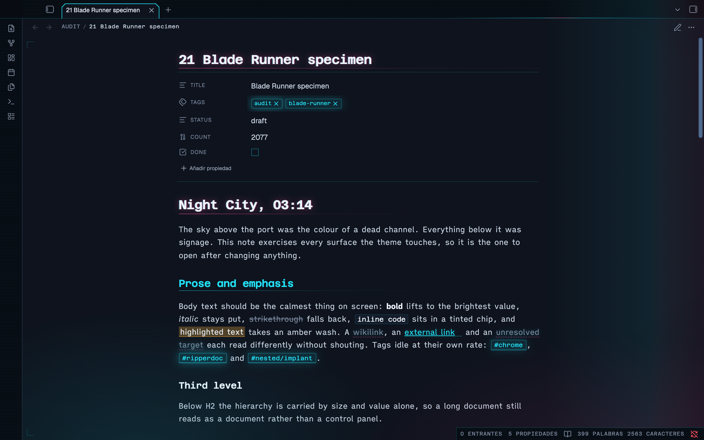
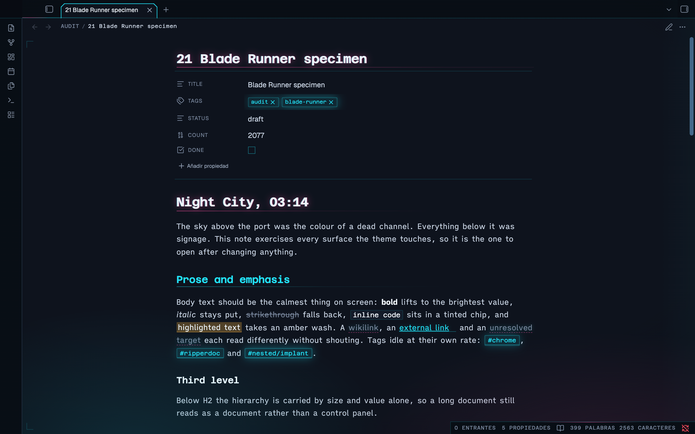
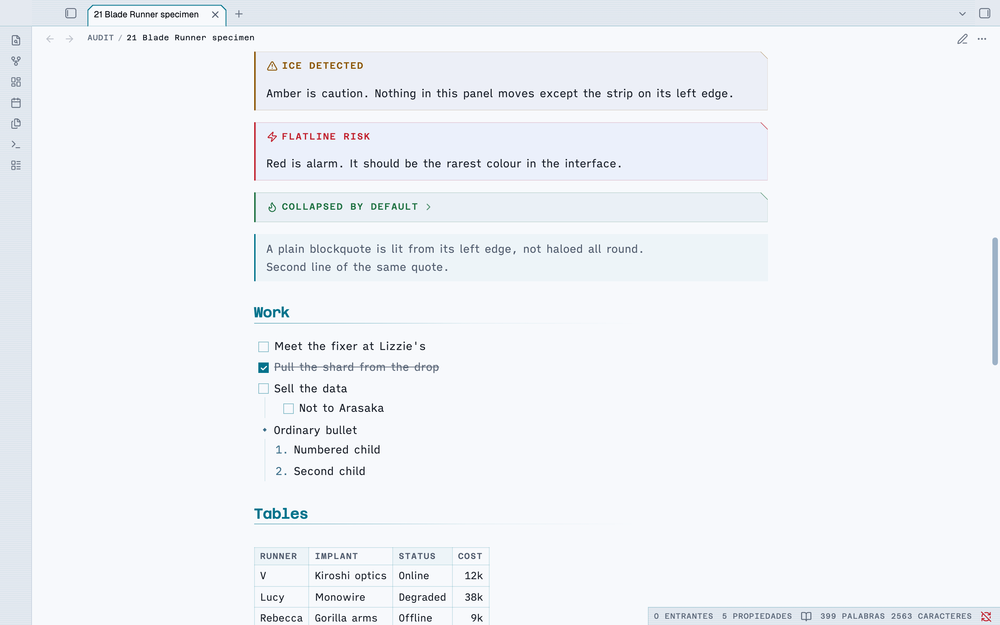
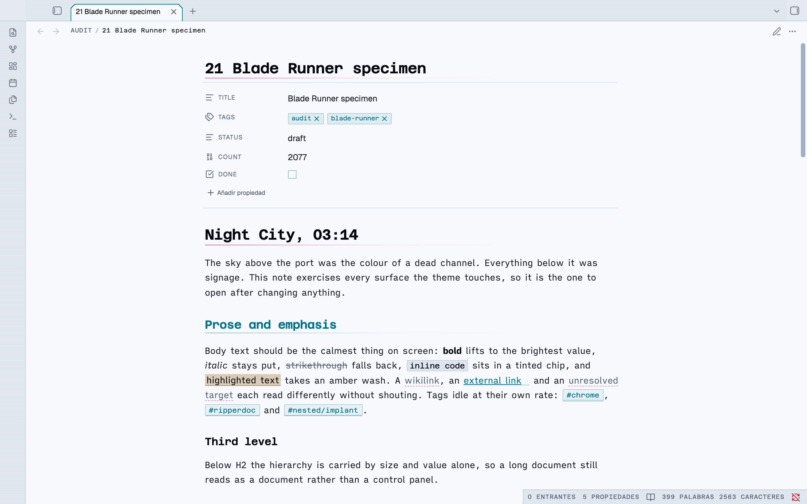
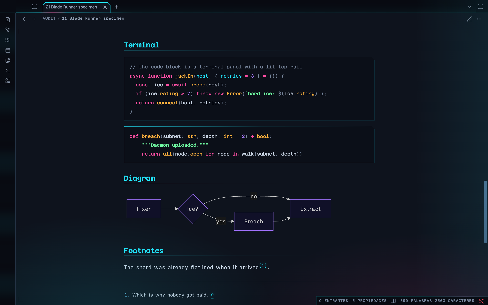

# Blade Runner

**An Obsidian theme where the neon lives in the chrome and the page stays readable.**

High tech, low life. The city is dark and loud with signage; the screen you work at
is the one legible thing in it.

Dark and light · Style Settings · WCAG AA throughout · Obsidian 1.14+

---

## The one rule

Most neon themes are unreadable after ten minutes, because they put saturated colour
and glow on the running text over a true-black ground, which makes bright type halate.
So this one keeps the signage in the tabs, rails, markers, alerts and status readouts,
and leaves the prose alone.

- The ground is blue-black, never `#000`; body text is a soft blue-white, never `#fff`.
- The writing surface is the **lightest** plane in the window and the chrome around it
  is the darkest, so the page reads as a lit screen inside a dark city.
- Saturated colour is structural, not decorative. If a colour appears it means
  something: a level, a state, a kind.
- Glow is a highlight, not a texture — headings, active UI and focus only.
- Body text is never coloured, never glows and never moves.

Every text colour in both modes was measured against its real composited background,
and so was every interactive control in the chrome. All of it clears WCAG AA.

## Two modes, not one inverted

**Night City** is the flagship. **Day Shift** is a real second theme rather than an
inversion: smog-pale concrete, ink text, and the same five neons pulled down to a
lightness that works on paper. Glow is dropped entirely, because a glow on white is
just blur. The chamfers, monospace labels and marker bars stay.

| Night City | Day Shift |
| :--: | :--: |
|  |  |

## Live signage

A dark city is never still.

| | |
| --- | --- |
| **Breathing** | Tags, file-type chips, the alert strip on each callout and the active file's edge idle between dim and lit. |
| **Faults** | Three flicker patterns on four mutually prime periods — the active tab stutters, the vault plate browns out, the status readout dips mid-sweep, and only the alarm callouts develop a fault. Because 14, 23, 27, 31 and 43 seconds share no factors, no two faults in the room ever coincide. |
| **Scans** | A light creeps along the rail above the page, and a second runs the other way under the status bar. |
| **Street** | The coloured light bleeding up from below drifts over 74 seconds. |
| **Rain** | Two layers falling at different depths, lit by the signs. Off by default. |
| **Searchlight** | A soft band crosses the window every 52 seconds. |
| **Cold start** | The workspace warms up like a tube, once per session. |
| **Charge** | A file row takes a pulse of light as the pointer crosses it. |

Four rules keep it from becoming a strobe:

1. Nothing in the prose column moves except the caret. The glow always sits on its own
   layer, so the glyphs underneath hold still.
2. Nothing breathes in time with anything else — every element is offset, so it reads
   as a skyline rather than a heartbeat.
3. Every animation is `transform` or `opacity` only, so the layer stays on the
   compositor and never triggers a repaint. The rain loops by translating exactly one
   tile height with the lean supplied by a constant skew, so it has no seam.
4. It is dark-mode only, it honours `prefers-reduced-motion`, and **Freeze the city**
   stops all of it.

## Details worth finding

**Grab a divider and the frame comes up.** Take hold of any panel handle and *every*
division lights together — both ribbon edges, both sidebar edges, every resize handle,
the rail above the page, the rule under the status bar — like a schematic being
powered. The frame is tracked separately from content borders, so the structure lights
without the code blocks and tables inside the page flashing along with it.

**The title is slightly out of register.** In the dark, the note title and every H1
carry a one-pixel chromatic split: cyan left, magenta right, as though projected out
of alignment. One pixel is deliberate — at two it stops reading as a hologram and
starts reading as a typo.

**Tabs are chamfered.** Vertical sides, both top corners cut, open along the bottom
where the tab meets the page, drawn as a lit outline.

**Callouts are system alerts.** Cut corner, lit edge that idles at its own rate, a
title set as a machine label, and body text left at normal value so a callout can hold
three paragraphs and still be read.

## Install

**Manually**

1. Download `theme.css` and `manifest.json`.
2. Put them in `YourVault/.obsidian/themes/Blade Runner/` — the folder name must match
   the `name` in `manifest.json` exactly.
3. Reload Obsidian, then pick **Blade Runner** under Settings → Appearance → Themes.

Requires Obsidian **1.14.0** or later: the theme reads `--callout-color` as a colour,
which is how 1.14 exposes it, and uses `color-mix(in oklch, …)` throughout.

## Settings

Install [Style Settings](https://github.com/mgmeyers/obsidian-style-settings) for the
controls. Everything works without it — the plugin only overrides defaults the theme
already sets.

| Group | What it does |
| --- | --- |
| **Signal** | Primary and secondary accent — cyan, magenta, acid, amber, violet — and **Bloom**, how far neon bleeds into the dark. `0` turns every glow off. |
| **Typography** | Reading face, signage face, line height, line width. |
| **Structure** | Corner cut, heading rules, an optional heading level index in the margin. |
| **Atmosphere** | Rain and rain strength, searchlight, scanlines, grain, vignette, city light, registration marks, **Freeze the city**, **Signage life**. |
| **Custom colours** | Replace any of the five neons; each keeps a separate value for dark and light. |

Obsidian's own Appearance settings still control the text size and can override any of
the three font families.

## Fonts

The theme asks for faces it does not ship, and falls back cleanly when they are missing.

| Role | Face |
| --- | --- |
| Reading | [iA Writer Quattro](https://github.com/iaolo/iA-Fonts) — a duospace built for long-form writing |
| Signage and HUD | [Azeret Mono](https://fonts.google.com/specimen/Azeret+Mono) |
| Interface | [Geist](https://vercel.com/font) |
| Alternatives | Literata, Space Mono |

## cssclasses

Put any of these in a note's `cssclasses` frontmatter.

| Class | Effect |
| --- | --- |
| `br-wide` | 1000px measure |
| `br-full` | full-width measure |
| `br-terminal` | renders the whole note as a phosphor terminal session |
| `br-dossier` | sets the note on a bordered, bevelled panel |
| `br-no-title` | hides the inline title, for index and dashboard notes |

`width-1000` is honoured too.

## Swapping the icons

The settings and help glyphs are replaced by masking, since CSS cannot rewrite the path
data of an inline SVG: the core glyph is hidden with `visibility` and the replacement is
painted over it, filled with `currentColor` so it inherits every state the button
already has. Point `--br-settings-icon` or `--br-help-icon` at any single-colour SVG
data URI to change them.

## License

MIT — see [LICENSE](LICENSE).
